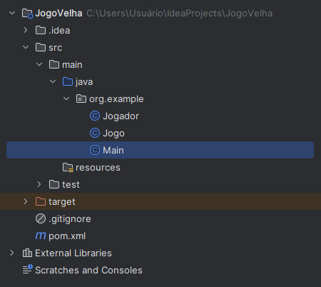
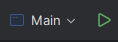
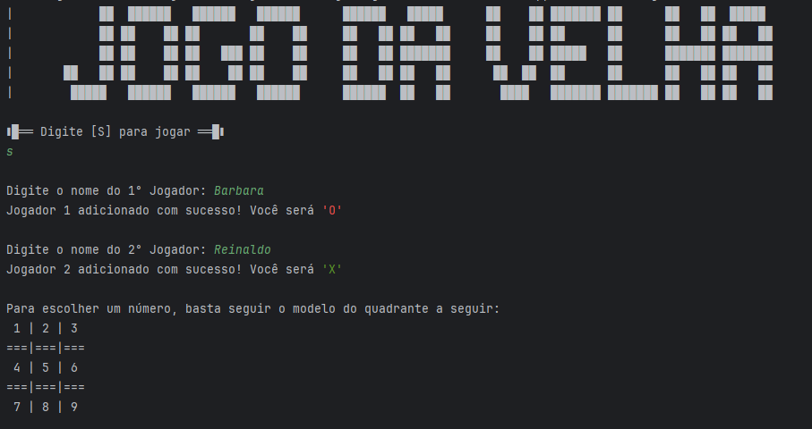

<h1> Jogo Da Velha #️⃣</h1>

## Bem-vindo👋

<p> Bem-vindo ao Jogo da Velha! Este é um projeto desenvolvido para aprimorar minhas habilidades em programação e proporcionar entretenimento para os jogadores.</p>


<h2>Utilizei:</h2>
<a></a>

## Descrição do Jogo

O Jogo da Velha é um jogo clássico de estratégia para dois jogadores. O tabuleiro é uma grade 3x3 e os jogadores alternam entre X e O para marcar as casas. O objetivo é conseguir três símbolos consecutivos na horizontal, vertical ou diagonal.

## Como Jogar

1. Clone este repositório em seu computador.

    ```bash
    git clone https://github.com/seu-usuario/JogoDaVelha.git](https://github.com/babi-barbato/JogoDaVelhaJava.git
    ```

2. Navegue até o diretório do projeto e abra em uma IDE.

    ```bash
    cd JogoDaVelhaJava
    ```

    

3. Execute a classe Main.
   
    

4. Siga as instruções no console para realizar os movimentos.

    

## Autora

Bárbara Barbato de Oliveira

---

Divirta-se jogando o Jogo da Velha! 🎮✨
